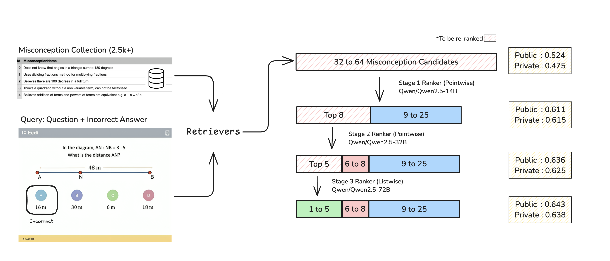
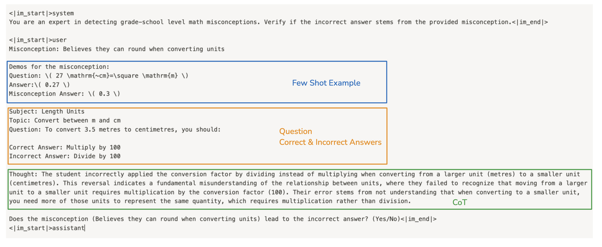
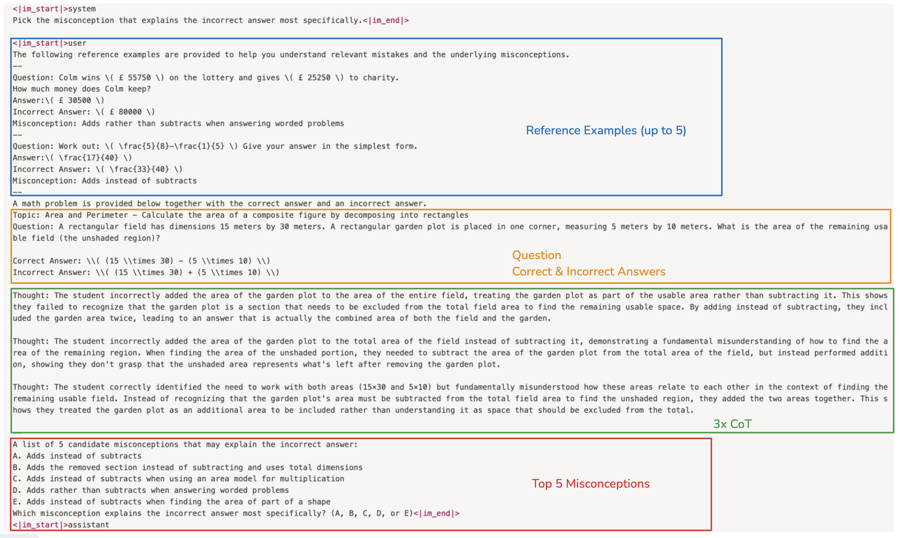

# Eedi - Mining Misconceptions in Mathematics

This repo contains my solution code for the `Eedi - Mining Misconceptions in Mathematics` Kaggle competition, which won 1st place. The full solution is described [here](https://www.kaggle.com/competitions/eedi-mining-misconceptions-in-mathematics/discussion/551688). Please refer to the following sections for details on dependencies, training, and synthetic data generation. If you run into any issues with the setup/code or have any questions/suggestions, please feel free to contact me at `rajabiswas92@outlook.com`. Thanks!

# 1 Setup
## 1.1 Compute
I rented compute from the [vast.ai](https://cloud.vast.ai/create/) cloud platform. The models were trained on an instance with the following specifications:
- 2x H100 SMX 80GB / 2x H100 NVL 94GB
- GPU Memory Bandwidth: 2045 GB/s
- Xeon® Gold 6448Y CPU (32 vCPUs)
- RAM: 256 GB
- Disk space: 512 GB

## 1.2 Environment
To train the models, launch a VM based using the [pytorch/pytorch:2.4.0-cuda12.4-cudnn9-devel](https://hub.docker.com/layers/pytorch/pytorch/2.4.0-cuda12.4-cudnn9-devel/images/sha256-e96c6896ecfbb50d89c87bf94110206ef444f27268c5f72201eb29fba9c90331) docker image. On vast.ai, you can use this [template](https://cloud.vast.ai?ref_id=67092&template_id=9de451a98218523e3cb068c1ecac9f14).

Next, please clone the repo and install the dependencies.

```
git clone https://github.com/rbiswasfc/eedi-mining-misconceptions.git
cd eedi-mining-misconceptions
pip install -r requirements.txt
pip install "flash_attn==2.6.3" --no-build-isolation
```

## 1.3 Download Datasets
Please export your Kaggle username and token to the environment variables `KAGGLE_USERNAME` and `KAGGLE_KEY`. It will be needed the download the competition datasets. The API keys can be obtained from the [Kaggle Settings page](https://www.kaggle.com/settings).

```
export KAGGLE_USERNAME=******
export KAGGLE_KEY=******
```

Next, download the required datasets by running:

```
python download_datasets.py
```

The script will download and cache several datasets using the [kagglehub](https://github.com/Kaggle/kagglehub) library:
- `eedi-mining-misconceptions-in-mathematics`: Competition dataset
- `conjuring92/eedi-five-folds`: 5-fold cross-validation splits. Please refer to [this notebook](https://www.kaggle.com/code/conjuring92/eedi-fold-split-5folds/notebook) for more details on validation.
- `conjuring92/eedi-silver-v3`: Synthetic dataset containing 1.8k competition MCQs + 10.6k synthetic MCQs
- `conjuring92/eedi-embed-pretrain-mix-final`: Synthetic dataset for pre-training of retrieval models
- `conjuring92/eedi-embed-mix-silver-v3`: Retriever fine-tuning dataset
- `conjuring92/eedi-ranker-silver-v3-teacher-blended-cot`: Pointwise re-ranker training dataset with CoT and teacher scores for distillation
- `conjuring92/eedi-tutor-mix-v8`: Listwise re-ranker training dataset
- `conjuring92/eedi-misconception-clusters`: Clusters of misconceptions for synthetic data generation
- `conjuring92/eedi-cot-gen-base`: Base dataset for generation of reasoning samples from Claude 3.5 Sonnet
- `conjuring92/eedi-cot-sonnet-6k`: 6k reasoning samples from Claude 3.5 Sonnet
- `conjuring92/eedi-cot-train-silver-v3`: Synthetic dataset (with minor processing pairing each question + incorrect answer combination) to be used for training the reasoning models

## 1.4 Download Models
It is recommended to download the required backbones from HF Hub before training the models. With [hf_transfer](https://github.com/huggingface/hf_transfer) downloading is much faster.

```
pip install huggingface_hub[hf_transfer]
HF_HUB_ENABLE_HF_TRANSFER=1 huggingface-cli download Qwen/Qwen2.5-Math-7B
HF_HUB_ENABLE_HF_TRANSFER=1 huggingface-cli download Qwen/Qwen2.5-14B
HF_HUB_ENABLE_HF_TRANSFER=1 huggingface-cli download Qwen/Qwen2.5-32B
HF_HUB_ENABLE_HF_TRANSFER=1 huggingface-cli download Qwen/Qwen2.5-72B
HF_HUB_ENABLE_HF_TRANSFER=1 huggingface-cli download intfloat/e5-mistral-7b-instruct
HF_HUB_ENABLE_HF_TRANSFER=1 huggingface-cli download BAAI/bge-en-icl
```

These backbones will be used for fine-tuning retrievers, re-rankers and reasoning models.

## 1.5 Accelerate Setup
Models were trained using the [HF accelerate](https://huggingface.co/docs/accelerate/en/index) library with DDP. Specifically, the following accelerate config was used:

```
compute_environment: LOCAL_MACHINE
debug: false
distributed_type: MULTI_GPU
downcast_bf16: 'no'
enable_cpu_affinity: false
gpu_ids: all
machine_rank: 0
main_training_function: main
mixed_precision: bf16
num_machines: 1
num_processes: 2
rdzv_backend: static
same_network: true
tpu_env: []
tpu_use_cluster: false
tpu_use_sudo: false
use_cpu: false
```
which can be configured by running `accelerate config` from the terminal.

# 2. Training
The solution pipeline involved 4 types of models:
- Retrievers: Used to retrieve top 32-64 misconceptions for a given Question and Incorrect Answer pair.
- Pointwise re-rankers (14B and 32B): Used to re-rank retrieved misconceptions. Model sees one misconception at a time in its context.
- Listwise re-rankers (72B): Used to re-rank retrieved misconceptions. Model sees top `n` misconceptions together in its context.
- Reasoners: Used to generate the reasoning behind selecting an incorrect answer. These reasoning traces are used in the re-rankers to help with ranking.




If you want to track training runs using `wandb`, please log in to your wandb account by running `wandb login` from the terminal.

## 2.1 Retrievers

The retriever models were trained using the `train_llm_embedding.py` script. Please run the following commands to fine-tune `intfloat/e5-mistral-7b-instruct` and `BAAI/bge-en-icl` for the misconceptions retrieval task.

```
accelerate launch ./code/train_llm_embedding.py --config-name conf_intfloat use_wandb=true full_fit=true
accelerate launch ./code/train_llm_embedding.py --config-name conf_bge use_wandb=true full_fit=true
```

The `full_fit` flag will train the models on all available data. If you want to validate model performance on `fold=0`, please set `full_fit=false`.

The `Qwen/Qwen2.5-14B` retriever was trained in two stages. It was first pre-trained on a synthetic dataset with large number of MCQs and misconceptions:
```
accelerate launch ./code/train_llm_embedding.py --config-name conf_qwen14b_pretrain use_wandb=true
```

Next, the LoRA adapters were merged with `Qwen/Qwen2.5-14B` to create the base model for the further fine-tuning:
```
python code/merge_adapter.py \
--backbone_path Qwen/Qwen2.5-14B \
--adapter_path ../models/eedi_embed_qwen14b_pretrain_lora \
--save_dir ../models/eedi_embed_qwen14b_pretrain
```

Finally, the merge model was fine-tuned similar to the other retriever models:
```
accelerate launch ./code/train_llm_embedding.py --config-name conf_qwen14b_finetune use_wandb=true full_fit=true
```

## 2.2 Reasoners

The reasoning models were trained using the `train_llm_reasoner.py` script. Please run the following commands to train the models.

```
accelerate launch ./code/train_llm_reasoner.py --config-name conf_reasoner_7b use_wandb=true full_fit=true
accelerate launch ./code/train_llm_reasoner.py --config-name conf_reasoner_14b use_wandb=true full_fit=true
accelerate launch ./code/train_llm_reasoner.py --config-name conf_reasoner_32b use_wandb=true full_fit=true
```

## 2.3 Re-rankers (Pointwise)
The pointwise re-rankers were trained using the `train_ranker_pointwise.py` script. Please run the following commands to train the models.

```
accelerate launch ./code/train_ranker_pointwise.py --config-name conf_pointwise_14b use_wandb=true full_fit=true
accelerate launch ./code/train_ranker_pointwise.py --config-name conf_pointwise_32b use_wandb=true full_fit=true
```
Training of the `32b` re-ranker requires `2xH100 NVL` GPU.

Pointwise re-rankers processed one misconception at a time in the context window. An example model input is shown below:



## 2.4 Re-rankers (Listwise)
The listwise re-rankers were trained using the `train_ranker_listwise.py` script. Please run the following commands to train the models.

```
accelerate launch ./code/train_ranker_listwise.py --config-name conf_listwise_72b use_wandb=true full_fit=true
```

Listwise re-rankers processed top 5 misconceptions together in the context window. An example model input is shown below:



# 3. Synthetic Data Generation
Synthetic data played a crucial role in improving both raw performance and generalization capability with respect to unseen misconceptions. It was generated with the help of Claude 3.5 Sonnet and GPT-4o. The synthetic examples can be accessed [here](https://www.kaggle.com/datasets/conjuring92/eedi-mcq-dataset/). Optionally, you can generate your own examples using the scripts in `synthetic` folder.

First, please make sure to export required API keys:

```
export OPENAI_API_KEY=***
export ANTHROPIC_API_KEY=***
```

Next, you can generate and curate synthetic data using the following scripts:
```
python synthetic/generate_claude.py --config-path conf/synthetic/conf_gen_claude.yaml
python synthetic/judge_oai.py --config-path conf/synthetic/conf_eval_oai.yaml
```

For Chain of Thought (CoT) generation, please run the following command:
```
python synthetic/cot_claude.py --config-path conf/synthetic/conf_cot_claude.yaml
```

Notes:
- This [notebook](https://gist.github.com/rbiswasfc/8d2bfec5c2a358e8beeb2df390111f9d) demonstrates clustering of similar misconceptions.
- CoT generation input dataset was processed by [this notebook](https://gist.github.com/rbiswasfc/aa5fc1450804f5f02787fb0d2c2e6ea6).

Please refer to clustering notebook
and [CoT generation preparation notebook](https://gist.github.com/rbiswasfc/aa5fc1450804f5f02787fb0d2c2e6ea6)


# 4. Inference
Trained models were quantized using [autoawq](https://github.com/casper-hansen/AutoAWQ) for inference. You can use the following commands to quantize different models:
```
python awq_quantization.py --model_path ../models/qwen_pointwise_merged --quant_path ../models/pointwise_awq --calib_data rbiswasfc/eedi-awq-calibration --max_calib_seq_len 1024
python awq_quantization.py --model_path ../models/qwen_listwise_merged --quant_path ../models/listwise_awq --calib_data rbiswasfc/eedi-awq-calibration-tutor --max_calib_seq_len 1600
python awq_quantization.py --model_path ../models/qwen_reasoner_merged --quant_path ../models/reasoner_awq --calib_data rbiswasfc/eedi-awq-calibration-cot --max_calib_seq_len 1024
```

You will need to update the model_path with the trained model path (after merging LoRA adapters). quant_path is the path where the quantized model will be saved.

My best selected inference notebook can be found [here](https://www.kaggle.com/code/conjuring92/eedi-a2-pipeline?scriptVersionId=211785645).

# References
- [vllm](https://github.com/vllm-project/vllm)
- [How To T̶r̶a̶i̶n̶ Synthesize Your D̶r̶a̶g̶o̶n̶ Data](https://www.answer.ai/posts/2024-10-15-how-to-synthesize-data.html)
- [FlagEmbedding](https://github.com/FlagOpen/FlagEmbedding)
- [AutoAWQ](https://github.com/casper-hansen/AutoAWQ)
